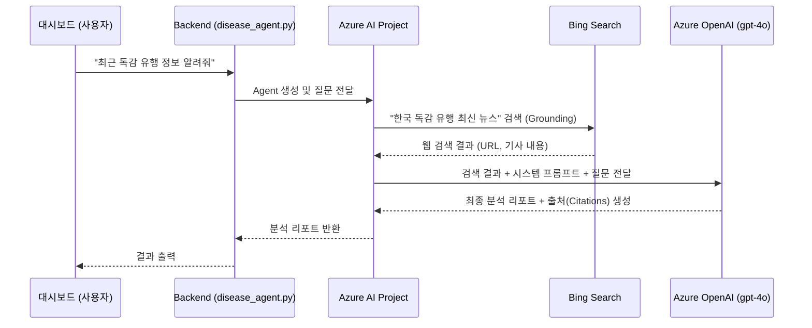

# 🚀 Azure Bing Search + AI Agent 아키텍처 및 사용 가이드

이 문서는 `setup_azure_resources.ps1` 스크립트를 통해 구축된 Azure 인프라 리소스들의 역할과, AI 에이전트가 어떻게 실시간으로 질병 정보를 검색하여 답변하는지 구조 및 사용법을 안내합니다.

---

## 🏗 1. 구축된 Azure 리소스 역할

자동화 스크립트를 통해 생성된 핵심 리소스 5가지는 다음과 같이 상호작용합니다.

1. **Azure Resource Group (리소스 그룹)**: 
   - 아래의 모든 리소스를 하나의 논리적 그룹으로 묶어 관리(비용, 생명주기)합니다.
2. **Azure AI Hub (AI 허브)**: 
   - 전사적인 AI 자원 및 보안 정책을 관리하는 최상위 워크스페이스입니다.
3. **Azure AI Project (AI 프로젝트)**: 
   - 개발자들이 직접 코드를 연결하고 에이전트를 구성하는 작업 공간입니다. (우리의 `PROJECT_ENDPOINT`가 이곳을 가리킵니다.)
4. **Azure OpenAI (gpt-4o)**: 
   - 사람처럼 자연스러운 요약과 분석을 담당하는 핵심 두뇌입니다.
5. **Bing Search v7 (빙 검색)**: 
   - AI의 '환각(Hallucination)'을 방지하고 최신 뉴스나 실시간 동향 데이터를 가져오기 위한 **Grounding(접지) 도구**입니다.

> [!TIP]
> **보안 (RBAC)**: 이전처럼 복잡한 API Key를 복사해서 쓰지 않고, 스크립트가 귀하의 계정에 `Azure AI Developer` 권한을 부여했습니다. 따라서 코드에서 `DefaultAzureCredential()` 하나만으로 안전하게 로그인됩니다.

---

## ⚙️ 2. AI 에이전트 동작 구조 (Workflow)

사용자가 대시보드(Frontend/Backend)에서 특정 질병("독감", "코로나19" 등)에 대해 분석을 요청하면 아래 순서대로 처리됩니다.



---

## 🛠 3. 사용 방법 (Usage Guide)

### 3.1. 최종 점검 (AI Studio 연결 확인)
CLI 스크립트가 리소스를 모두 만들었지만, AI Project와 Bing Search 간의 '연결'은 AI Studio에서 활성화해야 할 수 있습니다.
1. [Azure AI Studio](https://ai.azure.com/) 에 접속하여 생성된 프로젝트(`disease-ai-project` 등)로 이동합니다.
2. 좌측 메뉴에서 **Management > Connected resources (연결된 리소스)**로 이동합니다.
3. 리스트에 `Bing Search` (이름: `GroundingBingSearch`)가 있는지 확인합니다. 없다면 `+ New connection`을 눌러 생성한 Bing 리소스를 연결해 줍니다.

### 3.2. 환경 변수 확인
`backend/.env` 파일을 열어 다음 값이 정상적으로 들어있는지 확인합니다.
```env
PROJECT_ENDPOINT="https://..."
AZURE_OPENAI_DEPLOYMENT_NAME="gpt-4o"
BING_CONNECTION_NAME="GroundingBingSearch"
```

### 3.3. 파이썬 코드로 테스트 실행
에이전트 로직은 `backend/app/services/disease_agent.py`에 구현되어 있습니다. 이를 테스트해 볼 수 있습니다.

테스트를 위한 간단한 스크립트를 작성하여 백엔드 폴더(`backend`) 내에서 실행해 보세요. 예를 들어 `test_agent.py`를 다음과 같이 작성합니다:

```python
from app.services.disease_agent import analyze_disease_risk_with_grounding

# "코로나19" 키워드로 AI 빙 검색 분석 요청
result = analyze_disease_risk_with_grounding(disease_keyword="코로나19")

print("\n[AI 분석 결과]")
print(result.get("ai_analysis", result))

print("\n[참고 출처(Citations)]")
for citation in result.get("citations", []):
    print(f"- {citation['title']}: {citation['url']}")
```

> [!IMPORTANT]
> 로컬에서 위 코드를 실행할 때는 반드시 터미널에 `az login`으로 본인 계정이 로그인되어 있어야 `DefaultAzureCredential`이 권한을 정상적으로 획득합니다.
